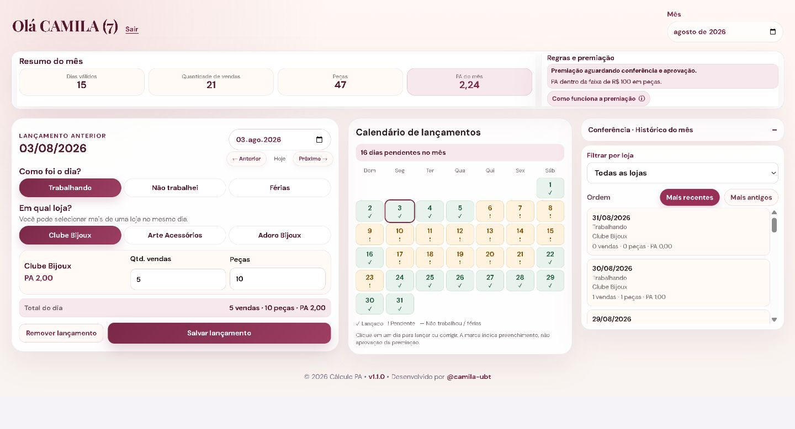
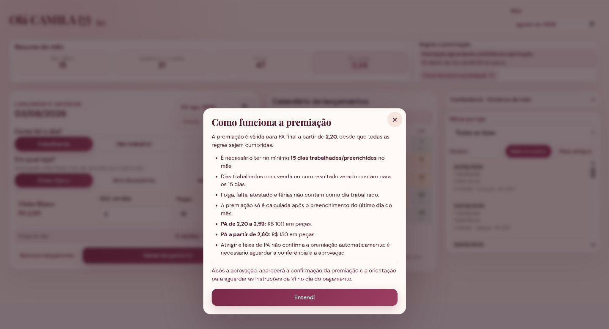

# Cálculo PA

Aplicação web para lançamento, cálculo e acompanhamento do **PA das vendedoras**, integrada ao mesmo Supabase utilizado pelo **Líder Metas**.

## O que o app faz

- login individual por vendedora;
- cadastro com primeiro nome, e-mail e número de vendedora no Athos;
- lançamento diário de vendas e peças por loja;
- cálculo automático do PA;
- calendário e histórico mensal;
- resumo do mês por loja;
- regras e acompanhamento de premiação;
- conferência administrativa;
- controle de acesso com RLS no Supabase.

## Capturas do sistema

### Painel no desktop

Lançamento diário com cálculo do PA, calendário, histórico e resumo mensal. Na captura de agosto de 2026, a premiação está aguardando conferência e aprovação.

### Regras de premiação

Consulta às faixas de PA, quantidade mínima de dias trabalhados e condições para aprovação da premiação.

## Atualizações da v1.3.0

- proteção local de autenticação isolada e testada;
- falhas de armazenamento local não interrompem o login;
- mensagens de erro de autenticação deixam de expor detalhes internos;
- redefinição de senha solicita encerramento global das sessões;
- CI passa a verificar padrões de chaves secretas no código da aplicação;
- regras de cálculo do PA e da premiação preservadas.

## Tecnologias

- Next.js
- JavaScript
- Supabase
- PostgreSQL
- Vercel

## Segurança

O projeto usa autenticação individual, políticas de **Row Level Security (RLS)** e separação de permissões entre vendedoras e administração. O frontend também aplica limite de tentativas para login, cadastro e troca de senha, com bloqueio temporário após falhas consecutivas. Variáveis sensíveis ficam fora do repositório e devem ser configuradas no ambiente de execução.

## Documentação

📚 **[Acessar a Wiki completa do Cálculo PA](https://github.com/camila-ubt/calculo-pa/wiki)**

A documentação detalhada de funcionamento, banco de dados, regras de negócio, segurança, configuração e manutenção também está versionada em [`docs/wiki`](./docs/wiki/Home.md).

## Versão

**v1.3.0 — Reforço de segurança e sessões.**

Desenvolvido por [@camila-ubt](https://github.com/camila-ubt).
