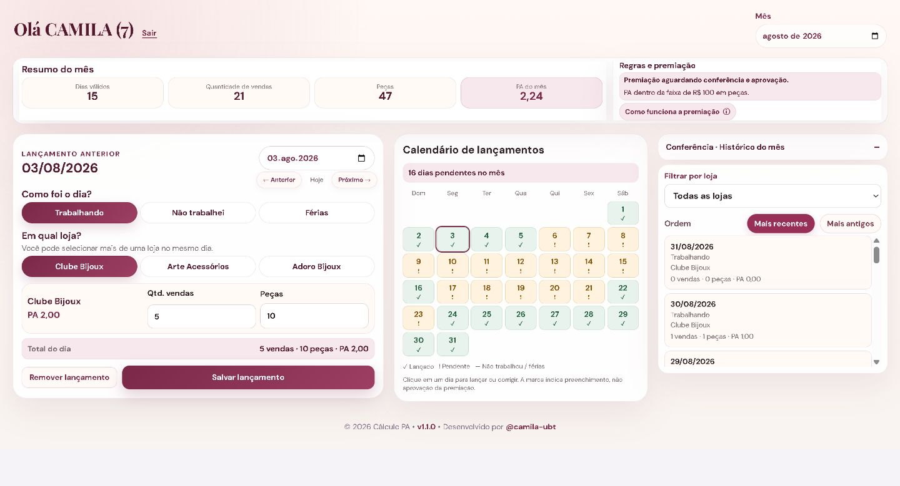

# Cálculo PA

Aplicativo para registrar vendas e peças e acompanhar o **PA (Peças por Atendimento)** das vendedoras. O PA é calculado pela divisão do total de peças pelo total de vendas.

**[Acessar o aplicativo](https://calculo-pa.vercel.app)** · **[Consultar a Wiki](https://github.com/camila-ubt/calculo-pa/wiki)**

## Como funciona

Cada vendedora acessa sua conta, escolhe a data e informa a situação do dia. Nos dias trabalhados, registra vendas e peças por loja. O painel calcula o PA e apresenta calendário, histórico e resumo mensal.

A premiação depende do PA do mês, de pelo menos 15 dias trabalhados e da conferência e aprovação da gestão. Meses fechados no Líder Metas permanecem disponíveis somente para consulta.

## Sobre o projeto

Desenvolvido com Next.js, JavaScript, Supabase e PostgreSQL, com hospedagem na Vercel. Compartilha o ambiente de dados com o Líder Metas e utiliza acesso individual e permissões no banco.

**Versão do projeto: v1.4.1.** Consulte as [releases](https://github.com/camila-ubt/calculo-pa/releases) para ver as versões publicadas.

Desenvolvido por [@camila-ubt](https://github.com/camila-ubt).
